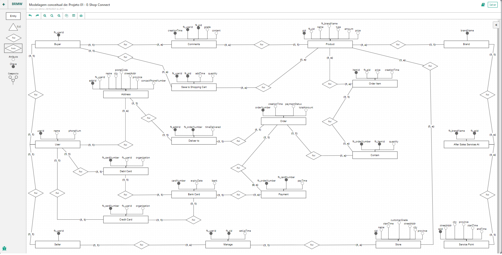

# E-Shop-Connect
Projeto de um sistema de comércio eletrônico feito no MySQL. 
# Modelagem do Banco de Dados

# Criação do Banco de Dados
Criei 20 tabelas no banco de dados. Veja uma delas:
´´´sql
CREATE TABLE users(
  pk_userId INT NOT NULL AUTO_INCREMENT,
  name VARCHAR(40) NOT NULL,
  phoneNum VARCHAR(12),
    
  PRIMARY KEY(pk_userId)
);
´´´
# Inserção de Dados
Foram inseridos vários dados em cada tabela.
´´´sql
INSERT INTO Brand VALUES('Asus');
INSERT INTO Brand VALUES('Bose');
INSERT INTO Brand VALUES('Canon');
INSERT INTO Brand VALUES('DELL');
INSERT INTO Brand VALUES('GoPro');
INSERT INTO Brand VALUES('Microsoft');
´´´
# Consulta de dados
Também fiz algumas consultas dentro do meu banco de dados.
´´´sql
-- 2.g | Consultar a quantidade total de produtos que foram colocados no carrinho (shopping cart),considerando a loja com ID (sid) igual a 8
SELECT SUM(savetoshoppingcart.quantity) AS quantidade
FROM savetoshoppingcart
INNER JOIN product ON savetoshoppingcart.fk_pid = product.pk_pid AND product.fk_sid = 8;
´´´
